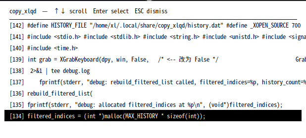

# copy_xlqd

> 一款轻量级、基于 X11 的剪贴板管理器，支持持久化历史记录与快捷键呼出弹窗。

## ✨ 特性
- 📋 **自动监听**：通过 `XFixes` 扩展实时捕获剪贴板变更
- 💾 **持久化存储**：内存缓存最多 500 条记录，自动写入磁盘，重启不丢失
- ⌨️ **极速弹窗**：单例守护进程 + `SIGUSR1` IPC，一键呼出/隐藏
- 🌍 **完美中文支持**：基于 `Xft` + `Fontconfig` 渲染，完整支持 UTF-8 与 CJK 字符
- 🔒 **零依赖/轻量**：纯 C 实现，无外部 UI 框架，资源占用极低
- 🔄 **智能去重**：连续复制相同内容自动跳过，节省空间

## 📸 截图

弹窗 

 

## 📦 依赖
编译与运行需要以下 X11 相关开发库：

| 发行版       | 安装命令                                                                 |
|--------------|--------------------------------------------------------------------------|
| Debian/Ubuntu| `sudo apt install build-essential libx11-dev libxfixes-dev libxft-dev libfontconfig1-dev` |
| Arch Linux   | `sudo pacman -S base-devel libx11 libxfixes libxft fontconfig`           |
| Fedora       | `sudo dnf install gcc libX11-devel libXfixes-devel libXft-devel fontconfig-devel` |

> 💡 建议安装 Noto CJK 字体以获得最佳渲染效果：`sudo apt install fonts-noto-cjk` (Debian/Ubuntu)

## 🛠 编译
```bash
gcc -O2 -o copy_xlqd main.c -I/usr/include/freetype2 $(pkg-config --cflags --libs fontconfig) -lX11 -lXfixes -lXft -lfreetype

做成全局命令
# 创建用户本地 bin 目录
mkdir -p ~/.local/bin

# 复制可执行文件
cp copy_xlqd ~/.local/bin/

# 添加到 PATH（根据你的 shell 选择）
# 对于 bash
echo 'export PATH="$HOME/.local/bin:$PATH"' >> ~/.bashrc

# 对于 zsh
echo 'export PATH="$HOME/.local/bin:$PATH"' >> ~/.zshrc

# 重新加载配置
source ~/.bashrc  # 或 source ~/.zshrc

如何设置开机自启动呢
echo '~/.local/bin/copy_xlqd > /dev/null 2>&1 & disown' >> ~/.bashrc

最后设置ubuntu自定义快捷键
名称：为此快捷键起个名字（如：copy_xlqd）。
命令：输入在终端中能运行该程序的指令（如启动对应的脚本或程序，copy_xlqd --toggle ）。
快捷键：点击“设置快捷键...”，然后按下您想要的组合键（如 Ctrl + Shift + N）。